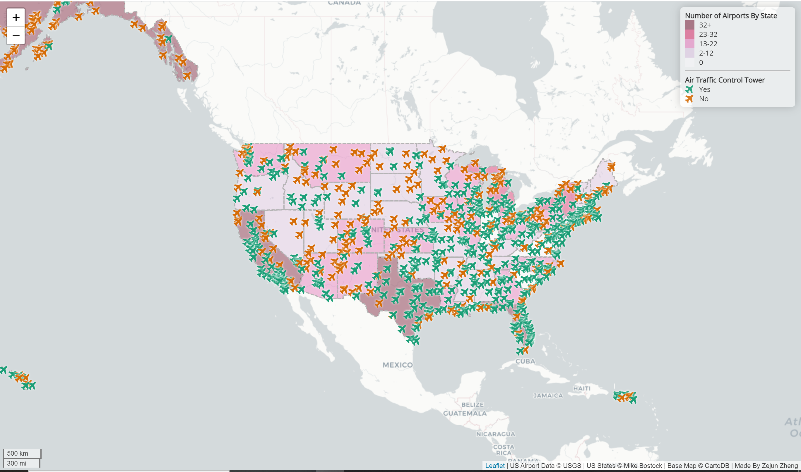

# US Airports Web Map
### Made by: Zejun Zheng 
  This repository contains the two geojson files. One is the airports.geojson, which contains all the airports in the United States. The other is the us-states.geojson, which contains all the states' boundaries of the United States. The interactive web map shows the distribution of airports in the US. 
  
  The map has shown the number of airports in each state, the larger the number of airports, the darker the color of the state. As shown in the map, California, Texas and Alaska  have the largest number of airports in the US, each of them has over 32 airports. All the states have at least one airport. 
  The map also demonstrates whether the airport has an air traffic control tower or not, if the airport has an air traffic control tower, it will display in green, otherwise, it will be red. As shown in the map, most airports in the US have the air traffic control tower. The airports that have air traffic control towers are more than the airports that do have air traffic control towers. 

The web map can be viewed at: http://zejunoliviazheng.github.io/AirportWebMap/

## Credit:   
US Airport Data &copy; USGS | US States &copy; Mike Bostock | Base Map &copy; CartoDB
## Reference: 
Data source:  https://catalog.data.gov/dataset/usgs-small-scale-dataset-airports-of-the-united-states-201207-shapefile
Boundary: https://d3js.org/
